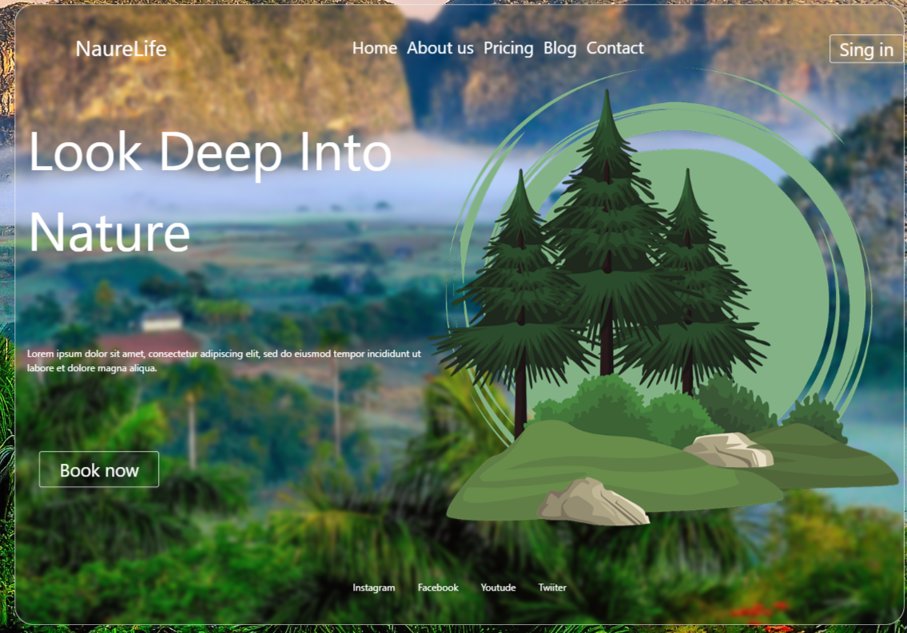
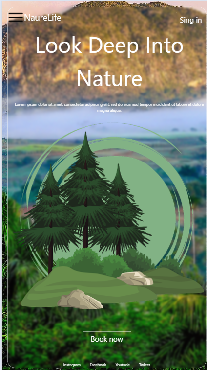

# sas-naturaza
## Ferramentas utilizadas: ##
* html 
* tailwind 
* git
## Resultados:
* ### Desktop

* ### Tablet

* ### Mobile

## Figma
### [FIGMA](https://www.figma.com/design/ojq0piYmt9VV07ASOsIjUo/lima---natureza--Copy-?node-id=2103-53&t=P9NalKLH9JcbF2Ob-0)
## Autor:
### [Gustavo de Paula Silva](https://www.linkedin.com/feed/?trk=guest_homepage-basic_nav-header-signin)
